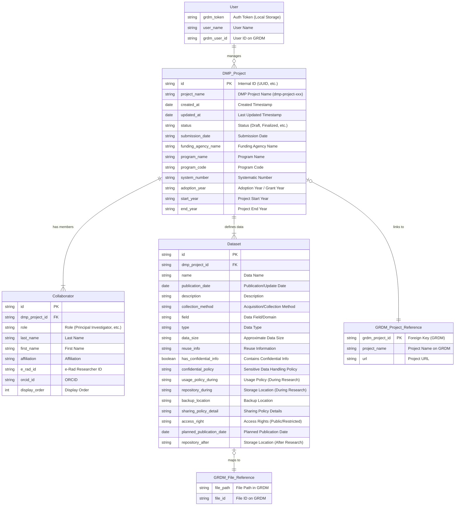

```mermaid
erDiagram
    %% Entity Definitions
    User ||--o{ DMP_Project : "manages"
    DMP_Project ||--|{ Collaborator : "has members"
    DMP_Project ||--|{ Dataset : "defines data"
    DMP_Project |o--|| GRDM_Project_Reference : "links to"
    Dataset |o--|| GRDM_File_Reference : "maps to"

    User {
        string grdm_token "Auth Token (Local Storage)"
        string user_name "User Name"
        string grdm_user_id "User ID on GRDM"
    }

    DMP_Project {
        string id PK "Internal ID (UUID, etc.)"
        string project_name "DMP Project Name (dmp-project-xxx)"
        date created_at "Created Timestamp"
        date updated_at "Last Updated Timestamp"
        string status "Status (Draft, Finalized, etc.)"
        
        %% Basic Information
        string submission_date "Submission Date"
        string funding_agency_name "Funding Agency Name"
        string program_name "Program Name"
        string program_code "Program Code"
        string system_number "Systematic Number"
        string adoption_year "Adoption Year / Grant Year"
        string start_year "Project Start Year"
        string end_year "Project End Year"
    }

    Collaborator {
        string id PK
        string dmp_project_id FK
        string role "Role (Principal Investigator, etc.)"
        string last_name "Last Name"
        string first_name "First Name"
        string affiliation "Affiliation"
        string e_rad_id "e-Rad Researcher ID"
        string orcid_id "ORCID"
        int display_order "Display Order"
    }

    Dataset {
        string id PK
        string dmp_project_id FK
        
        %% Basic Data Information
        string name "Data Name"
        date publication_date "Publication/Update Date"
        string description "Description"
        string collection_method "Acquisition/Collection Method"
        string field "Data Field/Domain"
        string type "Data Type"
        string data_size "Approximate Data Size"
        string reuse_info "Reuse Information"
        
        %% Security Policy
        boolean has_confidential_info "Contains Confidential Info"
        string confidential_policy "Sensitive Data Handling Policy"
        string usage_policy_during "Usage Policy (During Research)"
        string repository_during "Storage Location (During Research)"
        string backup_location "Backup Location"
        
        %% Publication Settings
        string sharing_policy_detail "Sharing Policy Details"
        string access_right "Access Rights (Public/Restricted)"
        date planned_publication_date "Planned Publication Date"
        string repository_after "Storage Location (After Research)"
    }

    GRDM_Project_Reference {
        string grdm_project_id PK "Foreign Key (GRDM)"
        string project_name "Project Name on GRDM"
        string url "Project URL"
    }

    GRDM_File_Reference {
        string file_path "File Path in GRDM"
        string file_id "File ID on GRDM"
    }
```
