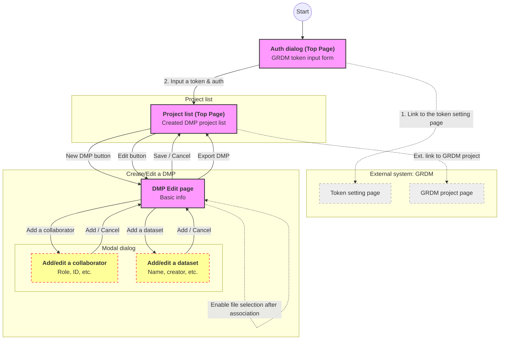

```mermaid
flowchart TD
    %% Node definition
    Start((Start))
    Auth["<b>Auth dialog (Top Page)</b><br/>GRDM token input form"]
    
    subgraph External_Systems [External system: GRDM]
        ExtToken[Token setting page]
        ExtProject[GRDM project page]
    end

    subgraph Dashboard [Project list]
        List["<b>Project list (Top Page)</b><br/>Created DMP project list"]
    end

    subgraph Editor_Core [Create/Edit a DMP]
        Editor["<b>DMP Edit page</b><br/>Basic info"]
        
        subgraph Modals [Modal dialog]
            ModalCollab[<b>Add/edit a collaborator</b><br/>Role, ID, etc.]
            ModalData[<b>Add/edit a dataset</b><br/>Name, creator, etc.]
        end
    end

    %% Transition definition 
    Start --> Auth
    
    %% Authentication flow
    Auth -.-> |"1. Link to the token setting page"| ExtToken
    Auth -- "2. Input a token & auth" --> List
    
    %% Actions in the project list page
    List -- "New DMP button" --> Editor
    List -- "Edit button" --> Editor
    List -.->|"Ext. link to GRDM project"|ExtProject
    
    %% Actions in the DMP edit page
    Editor -- "Save / Cancel" --> List
    Editor -- "Export DMP" --> List
    
    %% Modal operation
    Editor -- "Add a collaborator" --> ModalCollab
    ModalCollab -- "Add / Cancel" --> Editor
    
    Editor -- "Add a dataset" --> ModalData
    ModalData -- "Add / Cancel" --> Editor
    
    %% Associate GRDM projects
    Editor -- "Associate GRDM projects" --> Editor
    Editor -.->|"Enable file selection after association"| Editor

    %% Styles
    classDef main fill:#f9f,stroke:#333,stroke-width:2px;
    classDef ext fill:#eee,stroke:#999,stroke-dasharray: 5 5;
    classDef modal fill:#ff9,stroke:#f66,stroke-width:2px,stroke-dasharray: 5 5;
    
    class Auth,List,Editor main;
    class ExtToken,ExtProject ext;
    class ModalCollab,ModalData modal;
```
